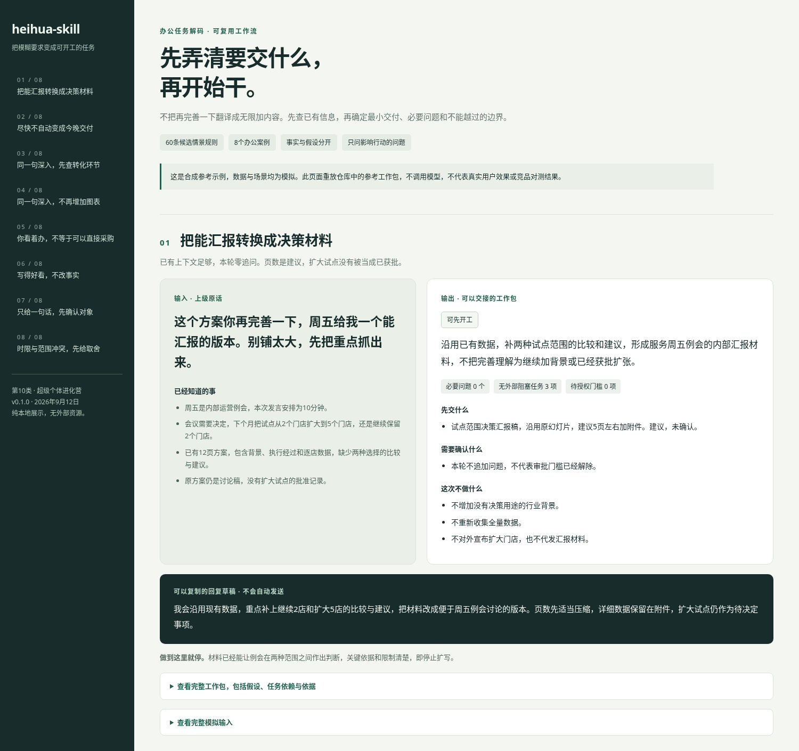

# heihua-skill

**把老板的模糊要求，变成一个有边界、能开工的工作包。**

老板说，再完善一下。你需要知道的不是还能加多少内容，而是这次到底要交什么。

heihua-skill 先看原话和已有材料，区分明确要求、合理推断和待确认事项。再给出最小交付物、执行顺序、必要问题、返工风险和可直接复制的回复草稿。

不是读心术，不是职场阴谋分析，也不是把中文短语机械替换成任务。


## 先看一个例子

上级原话。

> 这个方案你再完善一下，周五给我一个能汇报的版本。别铺太大，先把重点抓出来。

已经知道的背景。

周五是内部运营例会，发言10分钟。现有12页材料，已有逐店数据，会议需要决定试点继续保持2店还是扩大到5店。当前缺少两种选择的比较和建议，扩大试点尚未批准。

使用后的工作包摘要。

| 项目 | 输出 |
| --- | --- |
| 我理解的任务 | 补决策比较，形成便于例会作选择的汇报，不继续堆背景 |
| 默认假设 | 建议压成5页左右加附件，页数是建议，不是上级要求 |
| 先交什么 | 两种试点范围的比较、依据、限制与有条件的建议 |
| 先做什么 | 核对关键数字，再补比较，最后重排汇报主线 |
| 需要问什么 | 已有信息足够，本轮零追问 |
| 本轮不做 | 不新增无关研究，不宣布扩大试点，不代发材料 |
| 什么时候停 | 材料能支持两种范围之间的判断，证据和限制清楚即可 |

给上级的回复草稿。

> 我会沿用现有数据，重点补上继续2店和扩大5店的比较与建议，把材料改成便于周五例会讨论的版本。页数先适当压缩，详细数据保留在附件，扩大试点仍作为待决定事项。




下载仓库后双击 [docs/demo/index.html](docs/demo/index.html) 可查看完整离线演示。GitHub 文件页面可能只显示 HTML 源码，下载到本地再打开即可。演示页没有外部字体、脚本或联网请求。

## 同一句话，为什么不应固定翻译


| 已有上下文 | 应补的内容 | 不应该做的事 |
| --- | --- | --- |
| 只展示线索量柱状图，缺成交转化 | 核对漏斗、分母和转化变化 | 凭空解释因果、无目标地加模型 |
| 漏斗和渠道分析已经完整，但没有行动建议 | 比较改善跟进与调整投放的条件、代价和检验办法 | 重复已有图表，继续堆分析 |

对应 [案例03](examples/03-deeper-analysis/input.md) 和 [案例04](examples/04-deeper-decision/input.md)。原话完全一致，工作包不同。

另有一个重要反例。

你看着办，不要再问，并不等于可以未经批准选择供应商。这个 Skill 可以做到本轮零追问，同时把最终确认保持为待授权。见 [案例05](examples/05-approval-boundary/expected-output.md)。

## 它具体做什么

先读已经授权的上下文，避免重复问现有材料能回答的问题。

按证据提出候选解释。不把再完善一下当成方向已获认可，也不把能汇报自动当成十页 PPT。

把未知分成可查明、可逆假设和必须确认三类。正常情况只问零至两个影响行动的问题，高风险确认不能为了少问而省略。

先定最小交付物和验收，再拆工作。明确本轮不做的事，以及做到哪里可以停。

最后给两份不同用途的表达，对内工作包和对上回复草稿。草稿不会自动发送。

## 和现有skill的区别


| 竞品 | 已有能力与侧重点 | heihua-skill |
| --- | --- | --- |
| [requirements-clarity][c1] | 通过评分和多轮澄清形成软件需求 PRD | 不默认产出完整 PRD，先给办公最小交付 |
| [clarify][c2] | 已有先查上下文、最小必要澄清、假设记录和自主推进 | 不把少问问题称为独创，重点是中文办公场景、停止条件与回复草稿 |
| [clarify-ambiguous-requests][c3] | 找最重要歧义，问一个问题后等待 | 区分受阻工作与可先做的准备，不一律暂停全部工作 |
| [stakeholder-requirements-gathering][c4] | 面向分析需求的访谈、确认与分析 brief | 扩展到活动、改稿、采购准备、跨部门协作等办公任务 |
| [planning-and-task-breakdown][c5] | 将工作拆为有依赖、验收和验证的小任务 | 多处理一步，这句话究竟对应哪个工作缺口 |
| [brief-to-tasks][c6] | 从设计 brief 和代码上下文形成构建清单 | 不要求用户已经有设计 brief 或代码库 |
| [brainstorming][c7] | 探索想法，在实施前确认设计 | 聚焦日常任务接收，不把每次小改稿升级为完整设计讨论 |


## 安装


### 直接让任意一个智能体帮忙安装

```
请从 https://github.com/yhluo7/heihua-skill 安装 heihua-skill。

先阅读仓库 README.md 和 SKILL.md，再识别你当前支持的 Skill 安装方式，将它安装到用户级 Skill 目录。

安装后请验证 Skill 可以被发现，并告诉我如何调用。
```

### 不安装也能先试

让能够读取本地文件的助手先读取根目录 SKILL.md，然后提供原话和上下文。没有文件读取能力的聊天界面，可以粘贴 SKILL.md，并在需要时补充对应规则文件。


[c1]: https://github.com/softaworks/agent-toolkit/blob/main/skills/requirements-clarity/SKILL.md
[c2]: https://github.com/liqiongyu/my-agents/blob/main/skills/clarify/SKILL.md
[c3]: https://github.com/aiming-lab/MetaClaw/blob/main/memory_data/skills/clarify-ambiguous-requests/SKILL.md
[c4]: https://github.com/nimrodfisher/data-analytics-skills/blob/main/05-stakeholder-communication/stakeholder-requirements-gathering/SKILL.md
[c5]: https://github.com/addyosmani/agent-skills/blob/main/skills/planning-and-task-breakdown/SKILL.md
[c6]: https://github.com/julianoczkowski/designer-skills/blob/main/brief-to-tasks/SKILL.md
[c7]: https://github.com/obra/superpowers/blob/main/skills/brainstorming/SKILL.md
[codex]: https://developers.openai.com/codex/skills
[claude]: https://code.claude.com/docs/zh-CN/skills
